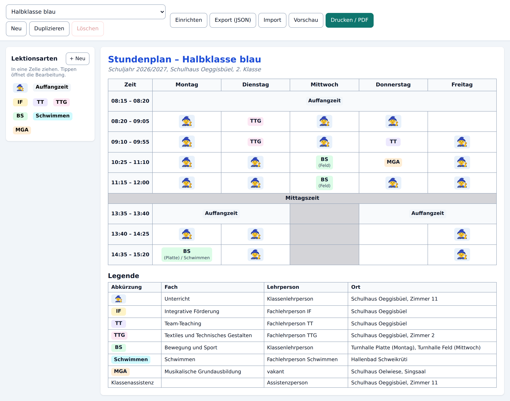

# Stundenplan-Creator

Schul-Stundenpläne per Drag & Drop zusammenstellen, im Browser speichern und als
PDF drucken — ohne Word-Tabellen und ohne Server.



## Was die App kann

- **Raster frei definieren:** Wochentage als Spalten, Lektionen als Zeilen mit
  eigenen Zeiten oder eigener Beschriftung.
- **Lektionsarten** mit Kürzel, Fach, Lehrperson und Ort — dargestellt als Text,
  als Bild (Emoji oder eigenes Bild) oder beides, mit eigener Farbe.
- **Drag & Drop, auch auf dem Handy:** Lektionsart aus der Palette in eine Zelle
  ziehen, zwischen Zellen verschieben oder tauschen, aus dem Raster
  hinausziehen zum Entfernen. Ein Tipp auf eine Zelle öffnet stattdessen einen
  Dialog — praktisch auf kleinen Displays.
- **Bänder über mehrere Tage** (z.B. «Auffangzeit» quer über Montag bis Freitag),
  **Trennzeilen** über die volle Breite (z.B. «Mittagszeit») und **gesperrte
  Zellen** für unterrichtsfreie Zeiten.
- **Legende** unter dem Plan, automatisch aus den Lektionsarten erzeugt und um
  eigene Zeilen ergänzbar.
- **Mehrere Pläne** verwalten, duplizieren, als JSON exportieren und importieren.
- **Druckausgabe auf A4 quer** mit eigener Vorschau.

## Wo die Daten liegen

Alles läuft im Browser. Die Pläne liegen im `localStorage` des jeweiligen Geräts
und werden bei jeder Änderung automatisch gespeichert; es gibt keinen Server und
keine Übertragung. Hochgeladene Bilder werden auf 256&nbsp;px verkleinert und als
Data-URL in die Konfiguration eingebettet, damit ein Export eine einzige,
weitergebbare Datei bleibt.

Zum Sichern oder Weitergeben: **Export (JSON)**. Die Datei lässt sich auf einem
anderen Gerät über **Import** wieder einlesen.

Die mitgelieferte Startvorlage nennt bewusst nur Platzhalter wie
«Klassenlehrperson» — sie wird öffentlich ausgeliefert. Echte Namen gehören in
den eigenen Plan.

## Drucken / PDF

**Drucken / PDF** öffnet den Druckdialog des Browsers; dort «Als PDF sichern»
wählen. Zwei Einstellungen lohnen sich:

- **Querformat** (das Stylesheet gibt A4 quer bereits vor)
- **Hintergrundgrafiken** aktivieren, sonst fehlen die Farbflächen der Lektionen
  und die grauen Zellen

Der Knopf **Vorschau** zeigt vorher, was auf dem Blatt landet.

## Entwicklung

```bash
npm install
npm run dev        # Entwicklungsserver
npm test           # Vitest
npm run typecheck  # TypeScript
npm run build      # Produktionsbuild nach dist/
npm run preview    # Produktionsbuild lokal ansehen
```

Nötig ist Node 20.19+ oder 22.12+.

### Aufbau

| Pfad | Inhalt |
| --- | --- |
| `src/types/config.ts` | Datenmodell des Stundenplans |
| `src/config/grid.ts` | Rasterlogik: Bänder auflösen, überdeckte Zellen, Ablageziele |
| `src/config/schema.ts` | Validierung und Migration eingelesener Konfigurationen |
| `src/config/defaults.ts` | Startvorlage und leerer Plan |
| `src/config/storage.ts` | `localStorage`-Anbindung |
| `src/config/io.ts` | JSON-Export/-Import, Bilder verkleinern |
| `src/state/reducer.ts` | Alle Zustandsänderungen als reine Funktionen |
| `src/components/` | Oberfläche (Raster, Palette, Legende, Editoren) |
| `src/styles/print.css` | Druckausgabe und Vorschau |

Das Raster ist eine echte `<table>` mit `colSpan`: Bänder lassen sich damit
direkt abbilden, und Tabellen brechen im Druck zuverlässig um.

## Konfigurationsformat

Ein exportierter Plan ist eine JSON-Datei nach diesem Muster:

```jsonc
{
  "schemaVersion": 1,
  "id": "plan_…",
  "name": "Halbklasse blau",
  "meta": {
    "title": "Stundenplan – Halbklasse blau",
    "subtitle": "Schuljahr 2026/2027, Schulhaus Oeggisbüel, 2. Klasse",
    "logoDataUrl": "data:image/png;base64,…"   // optional
  },
  "days": [{ "id": "day_mo", "label": "Montag" }],
  "rows": [
    { "kind": "lesson", "id": "row_0820", "start": "08:20", "end": "09:05" },
    { "kind": "separator", "id": "row_mittag", "label": "Mittagszeit" }
  ],
  "lessonTypes": [
    {
      "id": "lt_bs",
      "abbreviation": "BS",                    // steht in der Zelle
      "name": "Bewegung und Sport",            // steht in der Legende
      "teacher": "Klassenlehrperson",
      "location": "Turnhalle Platte",
      "display": "text",                       // "text" | "image" | "both"
      "icon": { "kind": "emoji", "value": "⚽" },
      "color": "#dcfce7",
      "showInLegend": true
    }
  ],
  "cells": {
    // Schlüssel: "<rowId>|<dayId>"
    "row_0820|day_mo": { "lessonTypeId": "lt_bs", "note": "(Feld)" },
    "row_1335|day_mo": { "lessonTypeId": "lt_auffangzeit", "daySpan": 2 },
    "row_1340|day_mi": { "blocked": true }
  },
  "legend": {
    "visible": true,
    "extraEntries": [
      { "id": "leg_1", "abbreviation": "Klassenassistenz", "name": "", "teacher": "…" }
    ]
  }
}
```

`daySpan` fasst ab dieser Zelle mehrere Tagesspalten zusammen; die überdeckten
Zellen entfallen. `blocked` markiert eine graue Zelle ohne Unterricht. Beim
Import wird die Datei geprüft und bereinigt: verwaiste Zellen, unbekannte
Lektionsarten und externe Bild-URLs werden verworfen.

## Deployment

Jeder Push auf `main` baut die App und veröffentlicht sie über GitHub Actions auf
GitHub Pages (`.github/workflows/deploy.yml`). Dafür muss unter *Settings →
Pages* als Quelle **GitHub Actions** eingestellt sein. Die Pfade sind relativ,
die App funktioniert deshalb auch in einem Unterverzeichnis.
